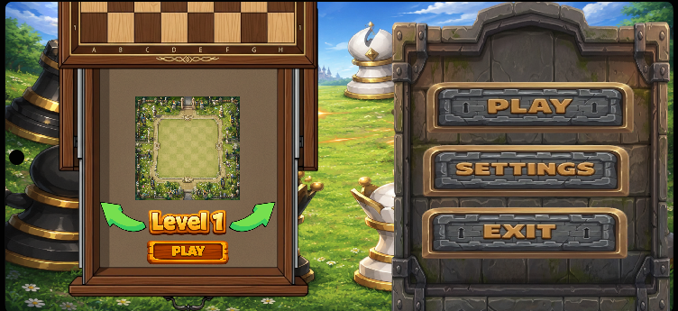
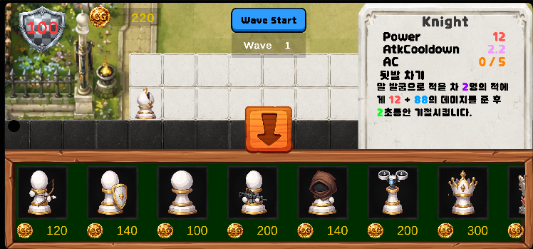
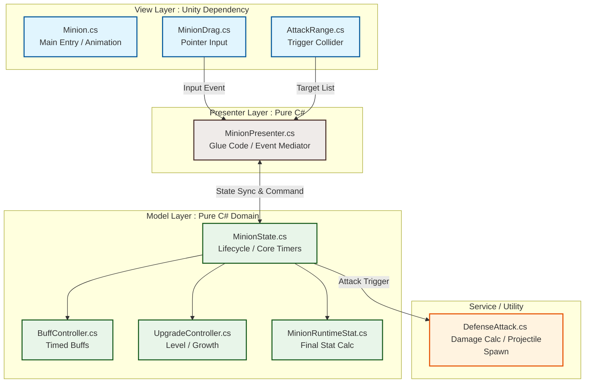
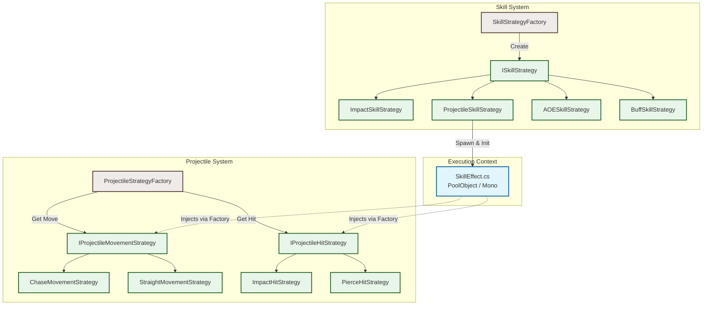
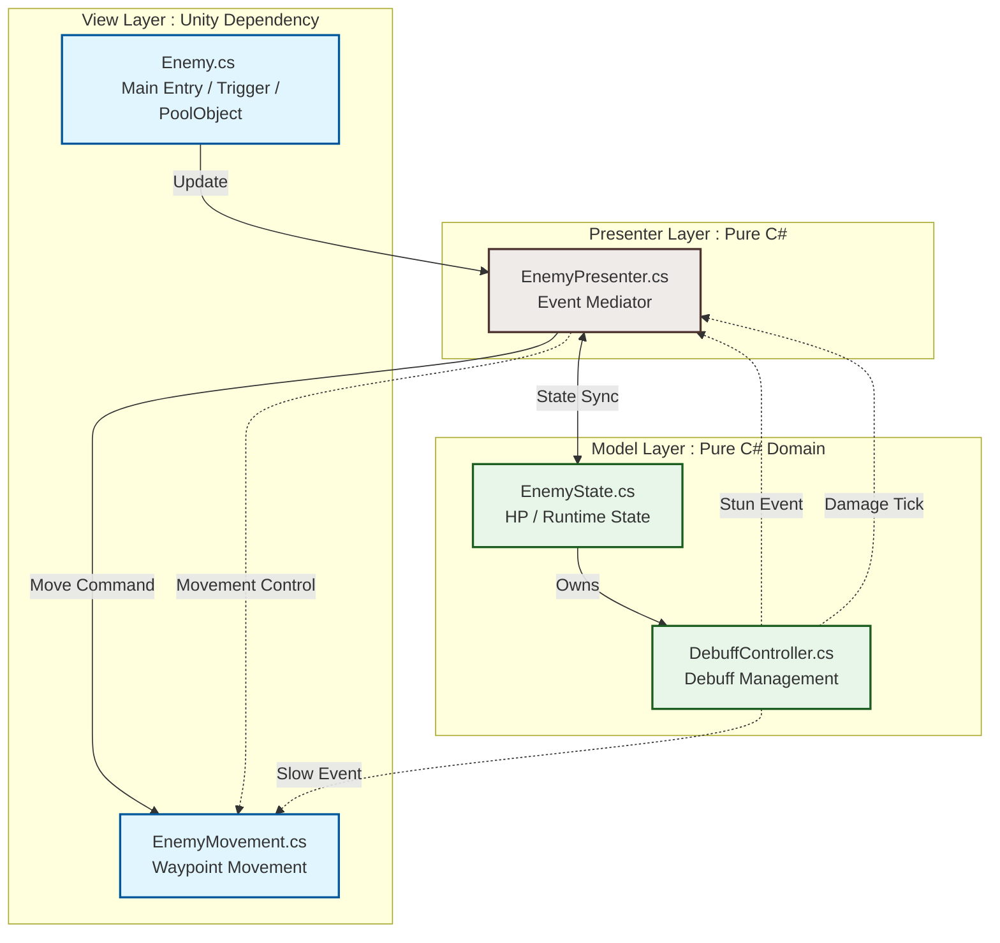
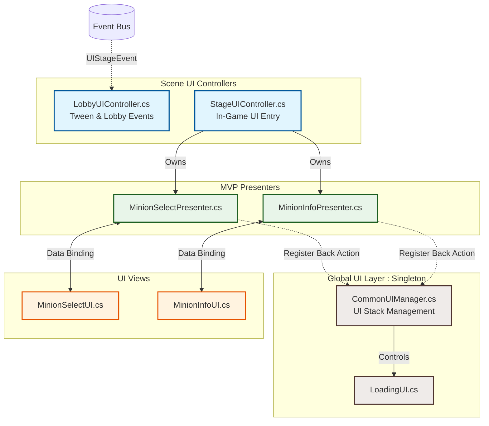

# Chess_Tower_Defense
## 주의사항

본 저장소는 공개(Public)용으로 정리된 버전입니다.

프로젝트에 포함되어 있던 일부 Private 코드, 설정 파일 및 유료 에셋은 라이선스 및 보안상의 이유로 제거되었습니다.

따라서 원본 프로젝트와 동일하게 동작하지 않을 수 있으며, 일부 기능은 제한되거나 동작하지 않을 수 있습니다.

본 저장소는 프로젝트의 아키텍처, 코드 설계 및 구현 방식을 문서화하여 제공하는 것을 목적으로 합니다.

<details>
<summary><b>1. 📝 프로젝트 소개</b></summary>

### 📅 개발 기간
* 2026.03 ~ (지속 개발 및 고도화 중)

### 📱 타깃 플랫폼
* **Android** (모바일)

### 👥 개발 인원 및 역할
* **1인 개발 (Solo Project)**
  * 프로젝트 아키텍처 설계 및 구현 (MVP 패턴 도입)
  * 핵심 전투 게임 루프, 스킬/투사체 전략 시스템 구현
  * Android 모바일 UI/UX 최적화 및 64비트 빌드 환경 설정 및 배포 대응
 
### 🎮 Download
 - **PlayStote Link** 
 https://play.google.com/store/apps/details?id=com.seeyou.chess_tower_defense

</details>

<details>
<summary><b>2. 🎮 게임 플레이 및 핵심 규칙</b></summary>

### ♟️ 체스 기물 모티브의 타워 디펜스
* **디펜스 룰 요약**: 웨이포인트를 따라 몰려오는 적(Enemy)들을 사거리 내 배치된 체스 기물의 일반 공격과 액티브 스킬을 활용하여 저지하고, 킹(본진)의 체력을 방어하는 것을 핵심 목표로 합니다.
* **성장과 업그레이드**: 기물 고유의 업그레이드 트리를 제공하며, 인게임 재화(Gold)를 통해 실시간으로 레벨을 확장하여 시너지 효과를 창출합니다.

### ♟️ 기본 조작법
* **스테이지 선택**: 오른쪽 Play 버튼을 누르면 왼쪽 체스판에 Stage를 선택할 수 있는 UI가 생성됩니다. 방향 버튼을 통해 Stage를 변경할 수 있으며, Level아래에 있는 Play 버튼을 누르면 선택된 스테이지를 시작합니다.
  
  
* **기물 배치**: 하단의 기물을 1초동안 터치를 유지하면 기물이 생성됩니다. 이후 드래그하여 흰색 타일 위에 놓으면 해당 위치에 기물이 배치됩니다.

</details>

<details>
<summary><b>3. 🛠️ 기술 스택 (Tech Stack)</b></summary>

* **Engine**: Unity 2022.3.62f3
* **Language**: C#
* **Libraries & Plugins**:
  * **DOTween**: 로비 및 인게임 UI 연출 애니메이션 제어
  * **Firebase Analytics**: 유저 데이터 및 스테이지 로그 수집
  * **ADMob**: 리워드 광고 및 광고 SDK 연동
* **Tools**: Ludo.ai (2D 스프라이트 및 애니메이션 생성)
</details>

<details>
<summary><b>4. 📂 프로젝트 디렉터리 구조 (Directory Tree)</b></summary>

```text
Assets/
├── 01.Scripts/
│   ├── Manager/            # GameManager, StageManager 등
│   ├── Minion/             # 미니언 MVP 패턴 (Model, View, Presenter)
│   ├── Enemy/              # 적 MVP 패턴 및 디버프 관리
│   ├── Skill/              # 스킬 및 투사체 전략 패턴 클래스
│   ├── UI/                 # UI 및 Scene별 UI Controller
│   └── Util/               # ScriptableObject 및 세이브 데이터
├── 02.Scenes/              # Lobby, Stage 등 핵심 씬
├── 03.Asset/               # 스프라이트 및 Animation
...
├── 05.Prefabs/             # 오브젝트 풀링용 프리팹
└── 06.ScriptableObjects    # Minion, Skill, Enemy 등의 SO 데이터
```
</details>

<details>
<summary><b>5. 🏗️ 주요 아키텍처 및 디자인 패턴</b></summary>
 
<details>
 <summary><b>🛡️ 미니언(Minion) 시스템 (MVP 패턴)</b></summary>
 
## 🛡️ 미니언(Minion) 시스템 설계 (MVP 패턴)

인게임 핵심 오브젝트인 `Minion` 계층은 유니티 엔진(`MonoBehaviour`)과의 결합도를 낮추고, 확장성 및 유지보수성을 극대화하기 위해 **MVP(Model-View-Presenter) 패턴**을 기반으로 설계되었습니다. 

단일 클래스가 무거워지는 'Fat View' 현상을 방지하기 위해, 데이터 계층(Model)을 상태 및 기능별 컨트롤러(Buff, Upgrade 등)로 세분화하여 독립적인 도메인 구조를 확립했습니다.

### 📐 구조도 (Architecture Overview)


### 🧩 계층별 역할 및 상세 분석

#### 1. View Layer (유니티 컴포넌트 및 클라이언트 입력 연출)
유니티 엔진 프레임워크에 종속적인 컴포넌트들로 구성되며, **"어떻게 화면에 보여주고 입력을 받을 것인가"**만 집중합니다. 절대 스스로 데이터를 수정하거나 가공하지 않습니다.
* **`Minion.cs`**: `MonoBehaviour` 및 상호작용 인터페이스(`ChessPiece`, `IPointerDownHandler`)를 상속받는 View의 메인 진입점입니다. 스프라이트 변경, 애니메이션 재생 등 시각적 연출을 담당합니다.
* **`MinionDrag.cs`**: 마우스/터치 드래그 입력을 감지하고 물리 레이어캐스트(`OverlapCircleNonAlloc`)를 통해 타일 위에 설치 가능한지 검증하는 배치 전용 컴포넌트입니다.
* **`AttackRange.cs`**: 트리거 콜라이더(`CircleCollider2D`)를 통해 사거리 내에 진입한 적(`Enemy`) 목록을 실시간으로 수집하고, 사거리 기즈모 가시성을 제어합니다.

#### 2. Presenter Layer (중재자 및 흐름 제어)
View와 Model 사이의 끈 풀린 연결고리 역할을 하는 순수 C# 클래스입니다. 외부 전역 이벤트 시스템과의 소통 및 데이터의 변화를 View에 전달하는 파이프라인 역할을 합니다.
* **`MinionPresenter.cs`**: 
  * View의 이벤트(`OnTouch`, `OnDragStart`, `OnPlacementSuccess` 등)를 구독하여 사운드를 재생하거나 글로벌 UI(`StageUIController`)에 정보를 띄우는 중재 작업을 수행합니다.
  * 글로벌 이벤트 버스(`WaveStartEvent`, `WaveEndEvent`)를 구독하여 웨이브 시작/종료 시점의 데이터 초기화 흐름을 제어합니다.
  * Model의 데이터가 변경되면 View의 애니메이션이나 스프라이트, 공격 범위를 동기화합니다.

#### 3. Model Layer (순수 비즈니스 로직 및 상태 데이터)
게임의 핵심 규칙과 수치 계산을 전담하는 순수 C# 도메인 영역입니다. 유니티 엔진에 의존하지 않으므로 독립적인 유닛 테스트가 가능합니다.
* **`MinionState.cs`**: 미니언의 생명 주기 동안 유지되는 상태 데이터(`SellGold`, `IsSiege` 등)와 실시간 공격 쿨타임 타이머(`UpdateTimer`) 계산 로직을 가집니다. 조건이 만족되면 `OnAttackReady`, `OnSkillReady` 이벤트를 Presenter로 발행합니다.
* **`MinionRuntimeStat.cs`**: 기본 스탯(`MinionData`)에 버프 및 강화 수치를 합산하여 실시간 최종 스탯을 산출합니다.
* **`BuffController.cs`**: 공속 버프, 공격 대상 증가 버프 등 다양한 유효 기한제 `Buff` 데이터를 코루틴을 통해 안전하게 관리하고 스탯에 적용/해제합니다.
* **`UpgradeController.cs`**: 기물 고유의 업그레이드 트리를 관리하고 레벨 성장을 체크하는 비즈니스 로직을 수행합니다.

#### 4. Service / Utility
* **`DefenseAttack.cs`**: Presenter가 공격 타이밍 신호를 주면, `AttackRange`가 수집한 타깃들을 기반으로 투사체(`Projectile`)를 생성하거나 즉시 타격(`Instant`) 대미지를 연산하여 적에게 전달하는 전투 서브 시스템입니다.

---

### 🌟 아키텍처 도입을 통해 얻은 이점 (Key Benefits)

1. **높은 재사용성**: 데이터 처리가 물리 뷰와 완벽히 쪼개져 있어, 동일한 `MinionState`와 `Presenter` 구조를 유지한 채 타일 위 배치 방식(`MinionDrag`)만 변경하거나 연출용 그래픽 오브젝트만 손쉽게 교체할 수 있습니다.
2. **사이드 이펙트 최소화**: 버프 연산(`BuffController`)이나 스탯 계산 로직에 버그가 발생하더라도 그래픽 렌더링이나 유니티 라이프 사이클 함수(`Update`)를 건드리지 않고 순수 C# 코드 내부에서만 안전하게 디버깅 및 디커플링이 가능합니다.
3. **이벤트 기반 동기화**: 프레임마다 뷰를 갱신(Polling)하지 않고, 스탯이나 상태가 변하는 시점에만 C# `Action` 이벤트를 발행하여 화면을 새로고침하므로 드로우콜 및 연산 최적화를 달성했습니다.

</details>

<details>
 <summary><b> ⚔️ 전투 및 스킬 시스템 설계 (Strategy & Factory Pattern)</b></summary>

## ⚔️ 전투 및 스킬 시스템 설계 (Strategy & Factory Pattern)

기물(Minion)의 일반 공격과 액티브 스킬은 **전략 패턴(Strategy Pattern)**과 **팩토리 패턴(Factory Pattern)**을 기반으로 설계되었습니다.

스킬의 실행 방식과 투사체의 이동 및 충돌 로직을 각각 독립적인 전략 객체로 분리하여, 새로운 공격 방식이나 투사체를 추가하더라도 기존 코드를 수정하지 않고 기능을 확장할 수 있도록 설계했습니다(OCP 준수).

또한 모든 스킬 오브젝트는 오브젝트 풀링(Object Pooling) 기반으로 재사용되며, 전략 객체는 팩토리에서 캐싱하여 런타임 객체 생성 및 가비지 컬렉션(GC) 발생을 최소화했습니다.

### 📐 구조도 (Skill & Projectile Overview)



### 🧩 계층별 역할 및 상세 분석

#### 1. Skill Strategy Layer (스킬 실행 전략)

스킬의 실행 방식을 담당하는 순수 C# 전략 계층입니다. `SkillType`에 따라 적절한 전략을 선택하며, `SkillStrategyFactory`에서 전략 객체를 캐싱하여 재사용함으로써 객체 생성 비용과 GC 부하를 최소화합니다.

* **`ImpactSkillStrategy.cs`**: 대상 위치에 스킬 이펙트를 생성하고 즉시 피해를 적용하는 즉발형 스킬을 처리합니다.
* **`ProjectileSkillStrategy.cs`**: 발사체를 생성하여 목표를 향해 발사하는 원거리 스킬을 처리합니다.
* **`AOESkillStrategy.cs`**: 공격 범위(`AttackRange`) 내의 모든 적에게 광역 피해를 적용합니다.
* **`BuffSkillStrategy.cs`**: 대상 아군에게 버프를 적용하고 스킬 사용 이후의 내부 상태를 갱신합니다.

#### 2. Projectile Strategy Layer (투사체 이동 및 충돌 전략)

투사체의 이동 방식과 충돌 판정을 각각 독립적인 전략으로 분리한 계층입니다. 이동 전략과 충돌 전략을 조합하여 다양한 형태의 투사체를 구현할 수 있으며, 새로운 투사체 추가 시 기존 코드를 수정하지 않고 확장이 가능합니다.

* **`IProjectileMovementStrategy`**: 투사체 이동 방식을 정의하는 인터페이스입니다.
    * **`ChaseMovementStrategy.cs`**: 목표를 지속적으로 추적하며 이동합니다. 대상이 사망하거나 유효하지 않을 경우 즉시 오브젝트 풀로 반환합니다.
    * **`StraightMovementStrategy.cs`**: 최초 방향을 유지한 채 직선으로 이동하며, 지속 시간이 종료되면 안전하게 풀로 복귀합니다.

* **`IProjectileHitStrategy`**: 투사체 충돌 방식을 정의하는 인터페이스입니다.
    * **`ImpactHitStrategy.cs`**: 단일 대상에게 피해를 입힌 후 투사체를 즉시 반환합니다.
    * **`PierceHitStrategy.cs`**: 피해만 적용하고 투사체는 유지하여 적을 관통하도록 처리합니다.

#### 3. Skill Context (재사용 가능한 실행 컨텍스트)

일반 공격과 액티브 스킬을 공통으로 처리하는 실행 컨텍스트입니다. 런타임에 필요한 전략을 주입받아 동작하며, 오브젝트 풀링 환경에서도 안전하게 재사용될 수 있도록 설계되었습니다.

* **`SkillEffect.cs`**
    * 일반 공격과 스킬 실행을 하나의 컴포넌트에서 처리하여 중복 로직을 제거합니다.
    * 발사체 모드(`isProjectile`)일 경우 `ProjectileStrategyFactory`를 통해 이동 전략과 충돌 전략을 런타임에 주입받습니다.
    * 모든 스킬 데이터와 전략 객체를 초기화한 뒤 실행하여 동일한 컴포넌트가 다양한 스킬 형태를 수행할 수 있도록 지원합니다.
    * `ReturnToPool()` 호출 시 전략 객체와 내부 상태를 모두 초기화하여 오브젝트 풀 재사용 시 발생할 수 있는 데이터 오염을 방지합니다.

---

### 🌟 아키텍처 도입을 통해 얻은 이점 (Key Benefits)

1. **높은 확장성**: 스킬 실행 방식과 투사체 이동·충돌 로직을 전략 패턴으로 분리하여 새로운 공격 방식이나 투사체를 기존 코드 수정 없이 추가할 수 있습니다(OCP 준수).

2. **낮은 결합도**: 스킬 실행, 이동, 충돌이 각각 독립적인 인터페이스를 통해 동작하므로 각 기능을 개별적으로 수정하거나 테스트할 수 있으며 유지보수가 용이합니다.

3. **실시간 성능 최적화**: 전략 객체를 팩토리에서 캐싱하고 `SkillEffect`를 오브젝트 풀링 기반으로 재사용하여 런타임 객체 생성과 가비지 컬렉션 발생을 최소화했습니다.

4. **재사용 가능한 실행 구조**: 일반 공격과 액티브 스킬이 동일한 실행 컨텍스트(`SkillEffect`)를 공유하도록 설계하여 코드 중복을 줄이고 다양한 공격 방식을 일관된 구조에서 관리할 수 있습니다.

</details>

<details>
<summary><b>👾 적 시스템 설계 (MVP 패턴)</b></summary>
 
## 👾 적 시스템 설계 (MVP 패턴)

적(`Enemy`) 시스템은 웨이포인트를 따라 이동하고 기물의 공격 대상이 되는 핵심 오브젝트로, **MVP(Model-View-Presenter) 패턴**을 기반으로 설계되었습니다.

유니티 컴포넌트(`MonoBehaviour`)와 순수 C# 도메인 로직을 분리하여 엔진 의존성을 최소화했으며, 스턴(Stun), 슬로우(Slow), 도트 대미지(DOT) 등 다양한 상태 이상은 독립적인 디버프 관리 계층에서 처리하도록 구성했습니다.

또한 모든 적은 오브젝트 풀링(Object Pooling) 기반으로 재사용되며, 이벤트 기반 동기화를 통해 이동, 상태 변화, UI 갱신이 독립적으로 이루어질 수 있도록 설계했습니다.

### 📐 구조도 (Enemy Architecture Overview)



### 🧩 계층별 역할 및 상세 분석

#### 1. View Layer (유니티 컴포넌트 및 이동 처리)

유니티 엔진에 종속되는 컴포넌트들로 구성되며, 화면에 적을 표시하고 이동 및 충돌과 같은 엔진 이벤트를 처리합니다. 비즈니스 로직은 직접 수행하지 않고 Presenter를 통해 전달합니다.

* **`Enemy.cs`**
    * 적의 메인 View이며 `MonoBehaviour` 기반 컴포넌트입니다.
    * 투사체 및 공격 충돌을 감지하고 Presenter에 피해 처리를 요청합니다.
    * 애니메이션과 오브젝트 활성화 상태를 관리하며 오브젝트 풀링과 연동됩니다.

* **`EnemyMovement.cs`**
    * 웨이포인트(PathManager)를 따라 적을 이동시킵니다.
    * 이동 속도 및 스턴 상태에 따라 이동 여부를 제어합니다.
    * 목적지 도달 시 Presenter에 이동 종료 이벤트를 전달합니다.

---

#### 2. Presenter Layer (중재자 및 흐름 제어)

View와 Model 사이를 연결하는 순수 C# 계층입니다. 적의 상태 변화와 이동, UI 갱신, 이벤트 발행 등을 중재하며 각 계층 간의 결합도를 최소화합니다.

* **`EnemyPresenter.cs`**
    * View에서 전달되는 피해 및 이동 이벤트를 Model에 전달합니다.
    * 체력 변화 시 HP UI를 갱신하고 사망 여부를 판정합니다.
    * 디버프 이벤트를 구독하여 이동 상태를 변경하고 View와 동기화합니다.
    * 적이 사망하면 `EnemyDeathEvent`를 발행하여 웨이브, 골드, 점수 시스템과 연동합니다.

---

#### 3. Model Layer (순수 비즈니스 로직 및 상태 데이터)

게임 규칙과 상태 계산을 담당하는 순수 C# 도메인 계층입니다. 유니티 엔진에 의존하지 않으며 독립적인 테스트가 가능합니다.

* **`EnemyState.cs`**
    * 체력, 이동 속도 등 적의 런타임 상태를 관리합니다.
    * 피해 계산, 사망 판정, 특수 피해 연산을 수행합니다.
    * 조건에 따라 즉사 판정 및 추가 피해 계산을 처리합니다.

* **`DebuffController.cs`**
    * 스턴, 슬로우, 도트 피해 등 지속 효과를 관리합니다.
    * Coroutine 기반으로 지속 시간을 관리하고 만료 시 자동 해제합니다.
    * 다중 슬로우 적용 시 감속률을 재계산하여 비정상적인 속도 감소를 방지합니다.
    * 스턴 면역 시간을 적용하여 무한 스턴이 발생하지 않도록 관리합니다.

---

#### 4. Object Pooling (재사용 및 상태 초기화)

적은 생성과 제거가 반복되는 오브젝트이므로 오브젝트 풀링을 통해 재사용됩니다. 풀로 반환되는 시점에 내부 상태를 모두 초기화하여 다음 사용 시 이전 데이터가 남지 않도록 설계했습니다.

* **`ResetForPool()`**
    * 이벤트 구독을 모두 해제합니다.
    * 실행 중인 Coroutine과 디버프를 종료합니다.
    * 체력과 이동 상태를 초기화합니다.
    * 내부 캐시와 런타임 데이터를 기본 상태로 복원하여 재사용 시 데이터 오염을 방지합니다.

---

### 🌟 아키텍처 도입을 통해 얻은 이점 (Key Benefits)

1. **높은 유지보수성**: 이동, 상태 관리, 디버프 처리의 역할을 분리하여 각 시스템을 독립적으로 수정하고 테스트할 수 있습니다.

2. **낮은 결합도**: View는 Presenter를 통해서만 Model과 상호작용하므로 UI 및 이동 시스템 변경이 비즈니스 로직에 영향을 주지 않습니다.

3. **안정적인 상태 관리**: 디버프를 독립적인 컨트롤러에서 관리하고 이벤트 기반으로 동기화하여 스턴, 슬로우, 도트 효과를 안정적으로 처리할 수 있습니다.

4. **실시간 성능 최적화**: 적 오브젝트를 풀링 기반으로 재사용하고 반환 시 모든 상태를 초기화하여 런타임 객체 생성과 GC 발생을 최소화했습니다.

 
</details>

<details>
<summary><b>📱 UI 아키텍처 및 화면 흐름 제어 (MVP & Stack Architecture)</b></summary>

## 📱 UI 아키텍처 및 화면 흐름 제어 (MVP & Stack Architecture)

게임 내 UI 시스템은 화면의 계층(Layer)과 역할을 명확하게 분리하고, 복잡한 화면 전환 및 뒤로가기(Back) 흐름을 안정적으로 관리하기 위해 **MVP(Model-View-Presenter) 패턴**과 **스택(Stack) 기반 UI 관리 구조**를 결합하여 설계되었습니다.

전역 UI는 `CommonUIManager`가 관리하고, 각 Scene UI는 독립적인 Controller가 담당하며, 세부 UI는 Presenter를 통해 View와 비즈니스 로직을 연결합니다. 이를 통해 UI 간의 결합도를 낮추고 기능별 확장성과 유지보수성을 확보했습니다.

### 📐 구조도 (UI Architecture Overview)



### 🧩 계층별 역할 및 상세 분석

#### 1. Global UI Layer (전역 UI 관리)

애플리케이션 전체에서 공통으로 사용하는 UI를 관리하는 싱글톤 계층입니다. 화면 스택과 뒤로가기 동작을 통합 관리하여 Scene 전환과 관계없이 일관된 UI 흐름을 제공합니다.

* **`CommonUIManager.cs`**
    * 전역 UI Stack을 관리하는 싱글톤 컴포넌트입니다.
    * 팝업 및 서브 UI가 열릴 때마다 닫기 액션을 `Stack<Action>`에 등록하여 화면 히스토리를 관리합니다.
    * 뒤로가기 입력 시 가장 마지막에 열린 UI부터 순차적으로 닫도록 처리합니다.
    * Scene 전환 또는 게임 재시작 시 `AllHideUI()`를 통해 모든 UI를 안전하게 초기화합니다.

* **`LoadingUI.cs`**
    * Scene 전환 과정에서 로딩 화면을 표시하는 전역 UI입니다.
    * 비동기 Scene 로딩 상태를 사용자에게 시각적으로 제공합니다.

---

#### 2. Scene UI Layer (Scene UI 제어)

각 Scene에서 사용되는 UI의 진입점 역할을 수행하는 계층입니다. 세부 UI의 비즈니스 로직은 Presenter에게 위임하고, Scene 단위의 화면 흐름만 제어합니다.

* **`StageUIController.cs`**
    * 인게임(Stage) UI의 메인 진입점입니다.
    * 기물 선택 UI와 정보 UI를 각각 Presenter에게 위임하여 관리합니다.
    * 기물 선택, 정보 갱신, UI 표시 및 숨김 등 Scene 전체의 UI 흐름을 제어합니다.
    * Scene 종료 시 Presenter를 해제하여 이벤트와 메모리를 안전하게 정리합니다.

* **`LobbyUIController.cs`**
    * 로비 화면의 UI와 애니메이션을 담당합니다.
    * `EventBus`를 구독하여 화면 전환 이벤트를 처리합니다.
    * DOTween을 이용한 UI 애니메이션과 사운드 재생을 통해 사용자 피드백을 제공합니다.

---

#### 3. Presenter Layer (UI 중재자)

View와 데이터 사이를 연결하는 순수 C# 계층입니다. UI는 Presenter를 통해서만 데이터를 변경하거나 조회하며, View는 데이터 구조를 직접 알지 않습니다.

* **`MinionSelectPresenter.cs`**
    * 기물 선택 UI와 게임 데이터를 연결합니다.
    * 선택 가능한 기물 목록을 갱신하고 View에 전달합니다.
    * 선택 이벤트를 처리하여 게임 시스템에 전달합니다.

* **`MinionInfoPresenter.cs`**
    * 선택된 기물의 정보를 UI에 표시합니다.
    * 스탯, 업그레이드 정보, 판매 정보 등을 View와 동기화합니다.
    * 데이터 변경 시 필요한 UI만 갱신하여 불필요한 업데이트를 최소화합니다.

---

#### 4. View Layer (UI 표시)

유니티 UI 컴포넌트로 구성된 계층으로, 사용자 입력과 화면 표시만 담당합니다. 데이터 가공이나 게임 로직은 수행하지 않으며 Presenter를 통해 전달받은 정보만 출력합니다.

* **`MinionSelectUI.cs`**
    * 기물 선택 화면을 표시합니다.
    * 버튼 입력을 Presenter에 전달하고 UI를 갱신합니다.

* **`MinionInfoUI.cs`**
    * 선택된 기물의 정보를 표시합니다.
    * Presenter가 전달한 데이터를 화면에 출력하며 사용자 입력을 전달합니다.

---

### 🌟 아키텍처 도입을 통해 얻은 이점 (Key Benefits)

1. **안정적인 화면 네비게이션**: `Stack<Action>` 기반으로 UI를 관리하여 다중 팝업과 모바일 뒤로가기 상황에서도 화면을 올바른 순서로 닫을 수 있습니다.

2. **낮은 결합도**: Scene Controller, Presenter, View의 역할을 명확히 분리하여 UI 변경이 게임 로직에 영향을 주지 않도록 설계했습니다.

3. **높은 유지보수성**: 기능별 Presenter를 독립적으로 구성하여 새로운 UI를 추가하거나 기존 UI를 수정하더라도 다른 시스템에 미치는 영향을 최소화했습니다.

4. **이벤트 기반 화면 갱신**: `EventBus`와 Presenter를 통해 필요한 시점에만 UI를 갱신하여 불필요한 Polling을 제거하고 효율적인 화면 업데이트를 구현했습니다.

</details>

</details>

<details>
 <summary><b>6. 🔄 공통 시스템 아키텍처</b></summary>

 <details>
  <summary><b>♻️ Object Pooling System</b></summary>

## ♻️ Object Pooling System

  인게임에서 빈번하게 생성 및 파괴되는 미니언, 적, 투사체, 이펙트 오브젝트로 인한 런타임 프레임 드랍(CPU Spike)과 가비지 컬렉션(GC) 부하를 방지하기 위해 중앙 집중형 오브젝트 풀링 시스템을 구축했습니다.

싱글톤 패턴 기반의 ObjectPoolManager와 추상 클래스인 PoolObject를 결합하여 구조적 안정성과 씬 전환 시의 메모리 정리 효율을 극대화했습니다.

### 🧩 핵심 구성 요소 및 코드 메커니즘 분석

**1. 다원화된 풀링 구조 (Multi-Queue Pool Architecture)**
다양한 형태의 인게임 자산을 효율적으로 관리하기 위해 데이터 특성에 맞춘 3가지 풀 레이어를 분리하여 운영합니다.

* **일반 풀 (`Dictionary<string, Queue<PoolObject>>`)**: 미니언, 적 등 문자열 키(`Prefab Name`)를 기반으로 동적 분류되는 범용 오브젝트 풀입니다.
* **스킬 전용 풀 (`Queue<SkillEffect>`)**: 전투 시스템의 핵심 컨텍스트인 `SkillEffect`를 별도 큐로 관리하여 딕셔너리 탐색 오버헤드조차 제거한 초고속 풀입니다.
* **이펙트 전용 풀 (`Dictionary<string, Queue<EffectObject>>`)**: 시각 연출용 타격 이펙트, 피격 효과 등을 별도로 격리하여 관리하는 연출 레이어 풀입니다.

**2. 추상화를 통한 상태 초기화 보장 (`PoolObject`)**
모든 풀링 대상 객체는 `PoolObject` 추상 클래스를 상속받아 구현됩니다.

* **`ReturnToPool()` 가상 메서드**: 객체가 풀로 돌아갈 때 단순히 `SetActive(false)` 처리하는 것에 그치지 않고, 각 도메인 내부에서 **이벤트 구독 해제, 코루틴 종료, 런타임 데이터 복원**을 강제 수행하여 데이터 오염을 차단합니다.

**3. 메모리 누수 방지 및 전체 회수 시스템 (`_activeObjectPool`)**
씬 전환이나 게임 종료 시 필드에 남아있는 액티브 객체들로 인한 메모리 누수를 방지합니다.

* **`HashSet<PoolObject>` 활용**: `Get`을 통해 필드로 나가는 모든 객체를 $O(1)$ 탐색 속도의 `HashSet`에 등록하여 실시간 추적합니다.
* **`ReturnAllActiveObject()`**: 씬 종료 시점 모든 활성 객체를 안전하게 순회하며 `ReturnToPool()`을 일괄 호출합니다. 이후 풀러를 클리어하여 잔존 인스턴스 프리징을 방지합니다.

---

### 🛠️ 구조적 고도화 및 코드 디테일

* **의존성 주입 안전성**: 프리팹 최초 `Instantiate` 시 `DontDestroyOnLoad` 처리와 `parent` 지정을 명확히 분리하여 유니티 생명주기를 안전하게 제어합니다.
* **중복 등록 방어**: `Get` 메서드에서 큐 반환 및 생성 시 `EnterActivePool()`이 적절히 트리거되어 활성 객체 누락을 방지하도록 설계되었습니다.

---

### 🌟 시스템 도입 이점 (Key Benefits)

1. **가비지 컬렉션(GC) 제로화**: 수많은 적과 투사체가 생성되는 환경에서도 추가적인 힙 할당을 억제하여 60fps 성능을 유지합니다.
2. **이벤트 기반 일괄 정리**: 게임 오버/웨이브 종료 시 `ReturnAllActiveObject()` 호출 단 한 번으로 필드를 깨끗하게 초기화합니다.
3. **확장성**: 새로운 객체 추가 시 `PoolObject`만 상속받으면 `ObjectPoolManager` 수정 없이 풀링 혜택을 즉시 적용 가능합니다.
 </details>

 <details>
 <summary><b> 💾 Save System </b></summary>

## 💾 데이터 저장 시스템 (Save System)

게임의 진행 상황, 상점 데이터, 환경 설정 등을 안전하게 보존하기 위해 **AES256 암호화**와 **JSON 직렬화**를 결합한 중앙 집중형 세이브 시스템을 구축했습니다. 로컬 파일 시스템에 저장되는 데이터의 무결성을 보장하고, 메모리 내에서 데이터 마커(Marker)를 통해 복호화 방식을 자동 판별하도록 설계되었습니다.

### 🧩 핵심 구성 요소 및 코드 메커니즘 분석

**1. 보안 계층 (AES256 & Base64 Encryption)**
단순 JSON 파일 저장은 유저에 의한 데이터 변조 위험이 큽니다. 이를 방지하기 위해 32바이트 대칭키(`PrivateKey`)와 16바이트 초기화 벡터(`PrivateIV`)를 사용하는 **AES256 암호화**를 적용했습니다.

* **데이터 마커 판별 (`DecryptAESIfNeeded`)**: 파일 로드 시 저장된 데이터의 마커(`AES256:`, `BASE64:`, 또는 평문)를 확인하여, 이전 버전과의 호환성을 유지함과 동시에 가장 최신의 보안 방식부터 순차적으로 복호화 로직을 수행합니다.
* **데이터 변조 방지**: 민감한 플레이어 데이터를 평문이 아닌 Base64 인코딩 및 암호화된 형태로 저장하여 외부 에디터로 인한 수치 조작을 1차적으로 차단합니다.

**2. 자동 복구 시스템 (Fault-Tolerant Load)**
파일이 없거나 손상되었을 때 게임이 멈추지 않도록 예외 처리(Try-Catch)와 기본값 생성 로직을 통합했습니다.

* **기본값 할당**: `PlayerData`, `ShopData`, `SettingData` 로드 실패 시, 에러 로그를 출력하고 기본 데이터(예: 1스테이지 시작, 초기 보유 골드 등)를 담은 객체를 즉시 생성하여 원활한 게임 진입을 돕습니다.

---

### 🛠️ 구조적 고도화 및 코드 디테일

* **데이터 마커 시스템**: 데이터 앞에 식별자(`Marker`)를 부착하여 인코딩 방식이 업데이트되어도 과거의 데이터를 안전하게 읽어올 수 있는 확장 가능한 저장 구조를 갖췄습니다.
* **중앙 집중형 로직**: `SaveSystem` 클래스가 모든 데이터를 정적 메서드로 관리하여, 씬 전환이나 게임 종료 시 호출 지점을 통일하고 일관된 암호화/복호화 정책을 강제합니다.

---

### 🌟 시스템 도입 이점 (Key Benefits)

1. **데이터 무결성 및 보안**: AES256 암호화를 통해 유저에 의한 세이브 파일 변조를 방지하고, 클라이언트 데이터의 보안 수준을 높였습니다.
2. **안정적인 오류 방어**: 세이브 파일이 삭제되거나 손상되더라도 강제 종료 없이 기본 데이터로 복구하여 유저 경험을 보호합니다.
3. **간편한 확장성**: `ShopData`, `SettingData` 등 새로운 저장 타입이 필요할 경우 동일한 암호화 파이프라인(`EncryptAES`, `DecryptAESIfNeeded`)을 재사용하여 쉽게 기능을 확장할 수 있습니다.
 </details>
</details>

<details>
 <summary><b> 📄 SO 데이터 생성 가이드 </b></summary>
 
 # 📄  SO 데이터 생성 가이드(Minion - Skill)

## 개요

본 프로젝트는 **CSV를 기준으로 데이터 관리**가 가능합니다.

다음 데이터는 **Export / Import**를 지원합니다.

- SkillData
- MinionData
- ChangeDefaultAttack

CSV를 수정한 후 Import를 실행하면

- 기존 데이터는 자동 수정
- 없는 데이터는 자동 생성

됩니다.

---

# 1. SkillData 작성

먼저 SkillData를 작성합니다.

### Export

```
Tools
└── Skill Data
    └── Export CSV
```

Export 시

```
Assets/CSV/SkillData.csv
```

가 생성됩니다.

---

### CSV 수정

새로운 스킬을 추가하거나 기존 데이터를 수정합니다.

예시

|항목|값|
|---|---|
|ID|5000|
|SkillName|Fire Ball|
|SkillDamage|100|

Hit / Kill / Buff는 **ID를 이용하여 연결**합니다.

예시

```text
HitEvent
2000|3|20

KillEvent
3000|5|50

Buff
4000|15|5|1000
```

각 의미

|데이터|형식|
|---|---|
|HitEvent|HitEventID \| Duration \| Value|
|KillEvent|KillEventID \| Duration \| Value|
|Buff|BuffDataID \| Increase \| Duration \| ChangeDefaultAttackID|

---

### Import

```
Tools
└── Skill Data
    └── Import CSV
```

Import 시

- SkillData 생성
- SkillData 수정
- HitEvent 연결
- KillEvent 연결
- BuffData 연결
- ChangeDefaultAttack 연결

이 자동으로 수행됩니다.

---

# 2. MinionData 작성

SkillData 생성 후 MinionData를 작성합니다.

### Export

```
Tools
└── Minion Data
    └── Export CSV
```

Export 시

```
Assets/CSV/MinionData.csv
```

가 생성됩니다.

---

### CSV 수정

예시

|항목|값|
|---|---|
|MinionIndex|1010|
|CharacterName|Knight|
|SkillID|5000|

Upgrade 예시

```text
1000|5|10|100;
1001|3|20|300;
1002|1|100|1000
```

형식

```text
UpgradeDataID | MaxLevel | Increase | Cost
```

---

### Import

```
Tools
└── Minion Data
    └── Import CSV
```

Import 시 자동으로

- MinionData 생성
- MinionData 수정
- SkillData 연결
- UpgradeData 연결
- Sprite 연결
- AnimationClip 연결
- AudioClip 연결

이 수행됩니다.

---

# 3. MinionItemData 자동 생성

MinionData Import 시 Shop Item도 자동으로 관리됩니다.

기존 ItemData가 존재하면

- 데이터 수정

존재하지 않으면

- 자동 생성

자동으로 설정되는 값

- ItemName
- Description
- Icon
- Price
- MinionData

ItemIndex는

```
프로젝트 내 존재하는 모든 ItemData 중

가장 큰 ItemIndex + 1
```

을 자동으로 사용합니다.

따라서 MinionIndex와는 별도로 관리됩니다.

---

# Sprite 관리

Sprite는 **Multiple Sprite**를 지원합니다.

CSV에는

- Sprite Path
- Sprite Name

을 저장합니다.

Import 시

- Path
- Sprite Name

으로 원하는 Sprite를 찾아 연결합니다.

---

# 데이터 연결 방식

Skill

```text
SkillID

5000
```

↓

```text
SkillData(ID = 5000)
```

---

Upgrade

```text
1000|5|10|100
```

↓

```text
UpgradeData(ID = 1000)
MaxLevel = 5
Increase = 10
Cost = 100
```

---

HitEvent

```text
2000|3|20
```

↓

```text
HitEvent(ID = 2000)
Duration = 3
Value = 20
```

---

KillEvent

```text
3000|5|50
```

↓

```text
KillEvent(ID = 3000)
Duration = 5
Value = 50
```

---

Buff

```text
4000|15|5|1000
```

↓

```text
BuffData(ID = 4000)
Increase = 15
Duration = 5
ChangeDefaultAttack(ID = 1000)
```

---

# 전체 작업 순서

```text
SkillData Export
        │
        ▼
SkillData CSV 수정
        │
        ▼
SkillData Import
        │
        ▼
MinionData Export
        │
        ▼
MinionData CSV 수정
        │
        ▼
MinionData Import
        │
        ├── MinionData 생성 / 수정
        ├── SkillData 연결
        ├── UpgradeData 연결
        ├── Sprite 연결
        ├── Animation 연결
        ├── Audio 연결
        └── MinionItemData 자동 생성 / 수정
```
</details>
